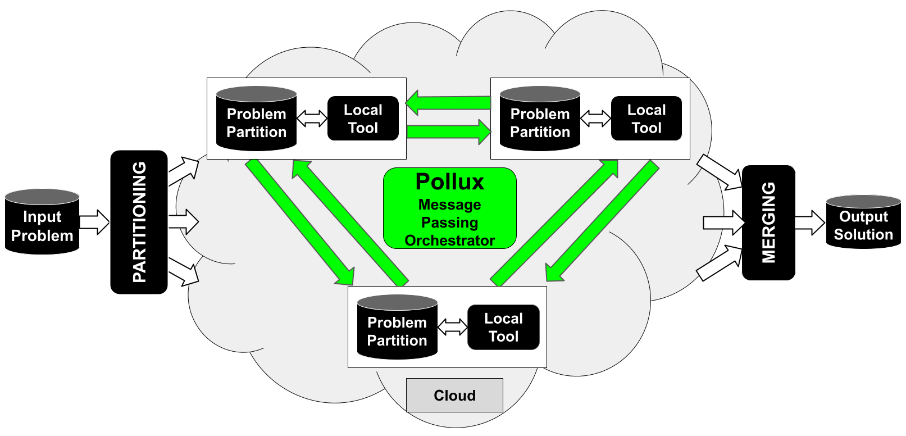
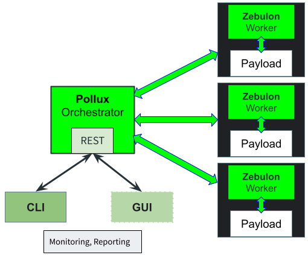

<div align="center">
<h1>Pollux</h1>
</div>




**Pollux** is a Cloud orchestrator designed to distribute and manage complex algorithms, including NP-Hard and Complete problems, across multiple cloud-based machines.
With **Pollux**, algorithms can seamlessly span the Cloud, ensuring synchronization and continuous communication among distributed components.
**Pollux** has been designed in order to support multiple languages for Payload.

**Pollux** architecture can be summarized in picture below.


https://github.com/nuvulu/pollux-payload/assets/3635601/3fa89970-34cd-44c1-8359-9802c0719ff4

## Use cases
Currently, the following **Pollux** use cases can be found:
 - [Pollux payload example](https://github.com/nuvulu/pollux-payload/blob/main/src/c%2B%2B/examples/test): a simple test application deploying a configurable number of workers and showing
 - [Pollux PSO - Particle Swarm Optimization](https://github.com/nuvulu/pollux-payload/tree/main/src/c%2B%2B/examples/pso): a [PSO](https://en.wikipedia.org/wiki/Particle_swarm_optimization) Pollux implementation.
 - [Pollux SAT](https://github.com/nuvulu/pollux-sat): a [SAT](https://en.wikipedia.org/wiki/Boolean_satisfiability_problem) Cloud orchestrator using a mix of divide&conquer and multi-threaded portfolios techniques. More details on the project page.

## Building and Installing
### Getting sources
```bash
# First clone the repository
git clone https://github.com/nuvulu/pollux-payload
# go inside it and init submodules
cd pollux-payload
git submodule update --init --recursive
```
At this point, you are good to test pollux, locally if you have docker installed or on the Cloud if you have an account.
## Quick Testing
### Configuration
### Modes
Running modes are managed through the "-m" options. Following modes are supported:
#### Local docker
This is the easiest mode to use to get started and the best step to prepare for Cloud deployment.

Use the pollux test [image]() to rapdidly test pollux. For this purpose, use the following pollux launcher command:
```bash
# Following command will launch 4 workers
python3 <pollux_payload_sources>/src/launcher/pollux.py -p polluxio/pollux-payload -m local_docker -n 4
```
#### Local
Local mode needs Pollux binaries to be installed locally.
Once you have downloaded them (`pollux` and `zebulon`) from [here](). Untar the archive in a directory and set a $POLLUX_INSTALL environment variable pointing to this directory.
```bash
mkdir pollux_install
cd pollux_install
wget pollux-latest.tar.gz
tar xvzf pollux-latest.tar.gz
export POLLUX_INSTALL $pwd
```
Once this is done, launch in local mode:
```bash
# Following command will launch 4 workers
python3 <pollux_payload_sources>/src/launcher/pollux.py -p polluxio/pollux-payload -m local -n 4
```
#### Cloud
##### Qarnot
[Qarnot](https://qarnot.com) is a Cloud provider harnessing. **Qarnot** offers free trial credits in a couple of clicks. To try deployment on Qarnot, first create an account on this [page](https://tasq.qarnot.com/login/).
Then retrieve your access token, save it locally and launch using following commands:
```bash
python3 pollux.py -m qarnot -n 10
```
## Launcher
### Pollux launcher
To launch Pollux applications, a launcher python script is provided [here](https://github.com/nuvulu/pollux-payload/blob/main/src/launcher/pollux.py).

Most convenient way is to create a `Python` virtual environment. With Python 3:
```bash
apt-get install python3-venv
pip3 install virtualenv
```
Then in a project directory, create an environment:
```bash
python3 -m venv pollux
```
Then activate it:
```bash
. pollux/bin/activate
```
Now that the environment has been created and launched, you can install the following `Python` libraries:
```bash
pip install pyyaml
```
If you plan to use the docker local mode:
```bash
pip install docker
```
If you plan to launch on Qarnot:
```bash
pip install qarnot
```


## Write your own Pollux payload
### Supported Payload languages
Currently, only `C++` is supported. `Python` support could be easily added (some early tests have been done).
### C++
First install following dependencies, On Ubuntu for instance:
```bash
sudo apt-get install cmake
sudo apt-get install g++
sudo apt-get install protobuf-compiler-grpc
sudo apt-get install libgrpc++-dev
```
Using [nix-shell](https://nixos.wiki/wiki/Development_environment_with_nix-shell):
```bash
nix-shell -p cmake #FIXME#
```

Copy relevant files:
```bash
#create a thirdparty dir
mkdir thirdparty
cd thirdparty
git submodule add https://github.com/polluxio/pollux-payload
```
### Dockerfile

```Dockerfile
```